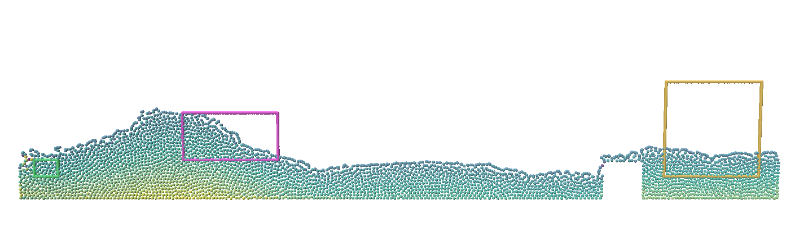
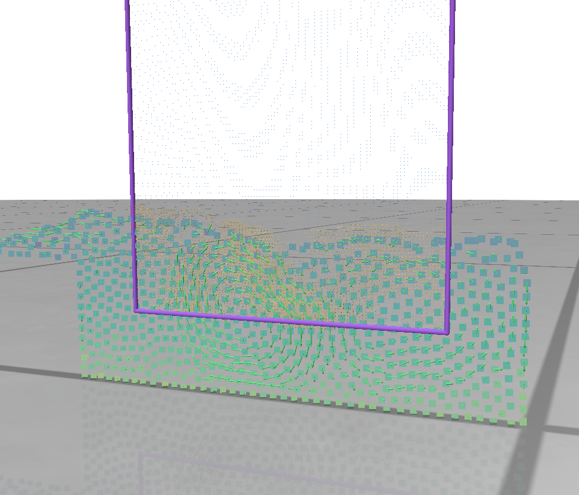

SPHPost
=======

This is my attempt at a SPH Post processor. Before you start asking for features / criticize, This was put together in 1 weekend (2 sleepless nights :D). But it has following capabilities

* Read VTP / PVTP files from a full simulation and hold it in data structures (using VTK library)
* Render results in extremely high quality (Renderer library has been removed as it is part of a bigger personal project that i develop with commercial intents).
* A control volume inspector which allows one to inspect various quantities inside specified control volumes (right now it just takes a bunch of boxes, in future, one would be able to draw arbitrary polygons interactively and see what happens within this control volume)
* Cartesian mesh (for control volume grids) / kDtree neighbour search to help interpolate various quantities. I have currently implemented Cubic spline kernel interpolation. I am open to implementing other things in future (All you have to do is ask).
* scalar field and vector field interpolation (diffusion based technique coming soon). I will also include a robust tensor field interpolation in future (based on Eigen decomposition).
* There is also a data set in data folder. I doubt that it is very useful, plug your own data set.

My plan is to produce a self containing container + archive that just takes a JSON file + VTK files and does everything.
If i see any interest in this, I will pursue further. If not, this stays here for archival purposes :)

Here are some images
Following images show a simple dam break simulation along with some square control volumes. I also shows close up of interpolation
in one of many of these control volumes.

P.S. Contact me if you are a SPH developer interested in visualizing specific things / physics as I am not interested in writing
CFD solvers as my focus is elsewhere. I have removed the renderer since I was able to get a surprising number of things working within a span of few hours.
Ask nicely and I may just give it to you :)